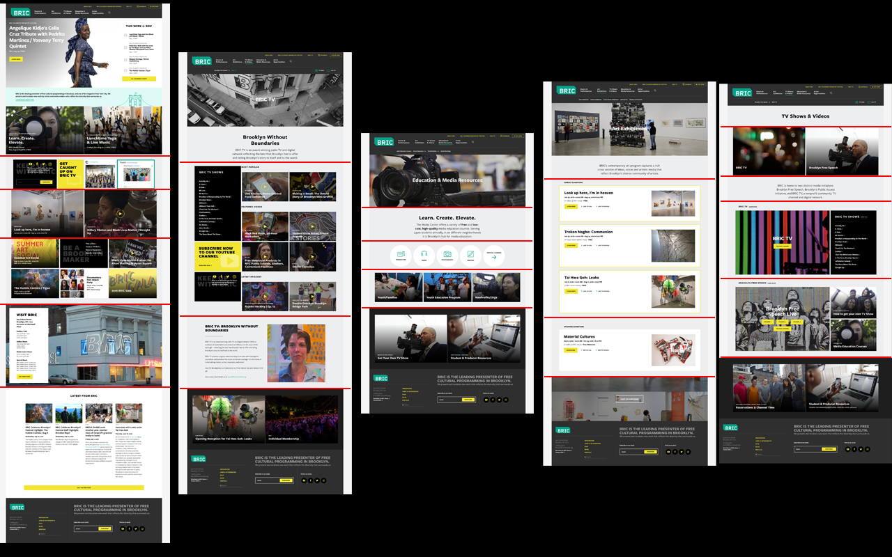
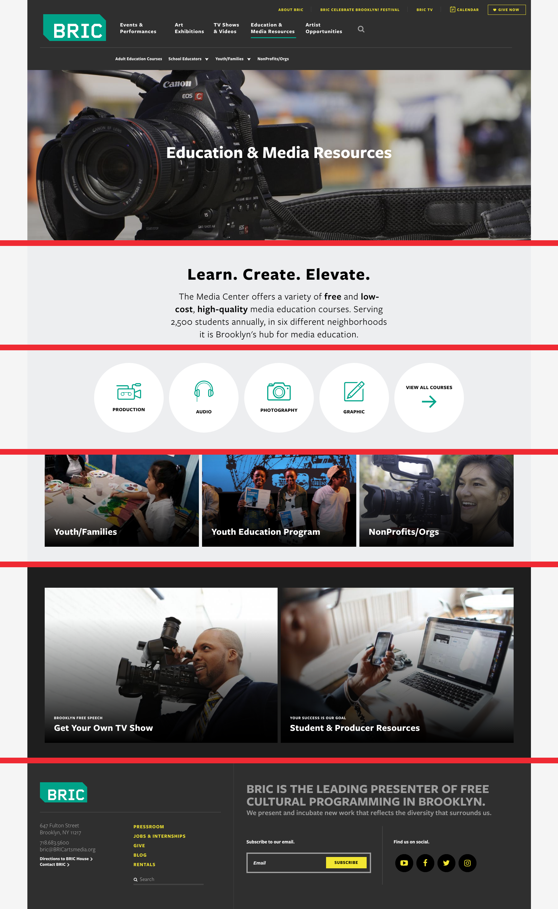
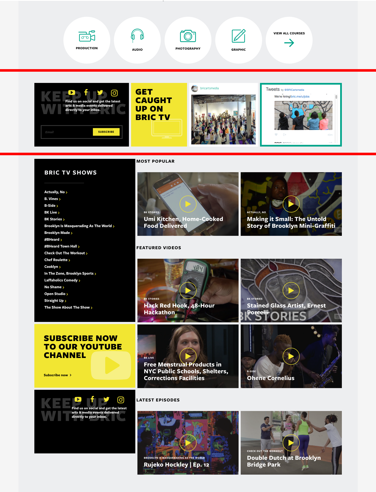
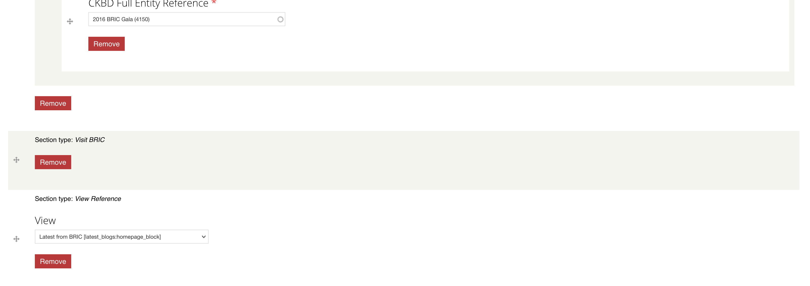

# Paragraphs!

^ The next Highlight of the site I want to present is how we used Paragraphs to achieve a modular site design that’s simple to administer and scales for the client’s future needs

^ BRIC Specifically, we believe paragraphs enhanced this site, that otherwise would have been a lot more custom code.

^ Thank you ___ for a great intro in Paragraphs module.
Show of hands, who is familiar with P module?

---

# Paragraphs!

^ Today I want to:
Walk us through our process with BRIC.
Second some Cool stuff we did.
Then real briefly some of the Pros and Cons of Paragraphs.

---

# Our Process
### Two main questions we ask ourselves for using Paragraphs module.

- How do we decide on using the Paragraphs Module?
- How do we decide what Paragraph Bundles to use?

---

## How do we decide on using the Paragraphs Module?

1. Type of site
  a. Build it and leave it type of site.
  b. Continually adding content.
1. Design
  a. Content or body of each design.
  b. How would an editor interact with this content?
  c. Could it be accomplished in another way?

^ First question to ask is:

^ 2 types of sites. 1. Build and leave it alone. 2. Content authors continually adding content.
If adding content site, adds flexibility for content authors and designs.
Specifically with BRIC, Events/Exhibitions, Blogs, Courses, General Pages.
As the developer, you need to make the call. I'd advise to make it early on.

---


^ These designs look very different, without paragraphs, there might be up to 4 different ways of handeling these layout.

^ We can achieve all these designs with one content type.

^ As you can see here, there are natural rows to these designs.

^ Once we've decided we want to use PARAGRAPHS, On to the second question...

---

## How do we decide what Paragraph Bundles to use?

### Design & Content

1. What is the content or body part of the page?
2. What needs to be flexible?
3. How would an editor interact with this content?

^ Second question is:

^ We are re-asking some of the same questions. But now we really care about the answers.

---



^ We sliced up the different sections.

---



^ Later we realized, we wanted this one section to always be at the footer. We pulled it out the body paragraph field and added a 'Footer callout' field at the bottom.

^ That is a very quick overview of how we decided to use PARAGRAPHS. Next, some of the fun stuff.

^ So these so far have been landing pages with What could be blocks. They are callouts to other sections. But you can even breakup detailed content pages into paragraphs as well.

---


^ Detail pages

^
Slideshow
Text
Special Button
Text
Youtube link

^ You can end up with a lot of bundles.

---


^ Here is a list of all our bundles

---

# Going beyond the basics

> You can also add custom option fields and do conditional coding in your CSS, JS and preprocess functions so that end-users can have more control over the look and feel of each item. This is way much cleaner and stable than adding inline CSS or classes inside the body field's source.

^ From the paragraphs module page. This I believe really is the power behind the paragraph bundles. Once you get past the tpls.

^ We had a lot of entity references to highlight sections or events throughout the site. And some override titles. But some of these we just weren't sure how to handle.

^ And here comes some of this fun stuff...

---



^ First, we have display of taxonomy terms.

^ Second, we pull in global social media accounts and sign up forms.

^ Third, Highly custom... but we are pulling in global settings for social media.

---

## 'Visit BRIC' Bundle


^ This is a bundle we wanted the be able to use throughout the site. But it has very specific content. Global content. We didn't want the author to re-create this content over and over again every time they wanted this bundle to show up.

^ so when the author adds this to their content, they don't have to fill in any fields. Its just there.

---

## 'Visit BRIC' Bundle



^ Here is what the admin sees.

^ SIDE NOTE: Now this can also be done with some custom fields, maybe a title or background image, etc, and global content.

^ How do we get the content there?

---

## Visit BRIC Settings Page


^ And then we have this helpful settings page to fill in the global content. And only one place to change the data.
And then we insert it through a hook.

---

``` php
/**
 * Implements hook_preprocess_entity().
 */
function bric_settings_preprocess_entity(&$vars, $hook) {
  if ($vars['entity_type'] == 'paragraphs_item') {
    if ($vars['paragraphs_item']->bundle == 'visit_bric') {
      // Grab settings variable.
      $settings = variable_get('bric_settings_visit_bric', array());
...
      // Build content array
      $vars['content']['bg_image'] = $bg_image_render_array;

      $vars['content']['address'] = array(
        '#markup' => check_markup($settings['address']['value'], $settings['address']['format']),
      );
      $vars['content']['hours'] = array(
        '#markup' => check_markup($settings['hours']['value'], $settings['hours']['format']),
      );

      $vars['content']['notes'] = ...
...
    }
  }
}

```

^ hook\_preprocess\_entity
target paragraphs_item entity
target the bundle

---

``` php
function bric_settings_preprocess_entity(&$vars, $hook) {
  if ($vars['entity_type'] == 'paragraphs_item') {
    if ($vars['paragraphs_item']->bundle == 'visit_bric') {
      // Grab settings variable.
      $settings = variable_get('bric_settings_visit_bric', array());
...
    }
  }
}

```

^ hook\_preprocess\_entity
target paragraphs_item entity
target the bundle
grab settings variable

---

``` php

      // Build content array
      $vars['content']['bg_image'] = $bg_image_render_array;

      $vars['content']['address'] = array(
        '#markup' => check_markup($settings['address']['value'], $settings['address']['format']),
      );
      $vars['content']['hours'] = array(
        '#markup' => check_markup($settings['hours']['value'], $settings['hours']['format']),
      );

      $vars['content']['notes'] = ...


```

^ hook\_preprocess\_entity
target paragraphs_item entity
target the bundle
grab settings variable
now process those fields


---

### Inserting the content
#### paragraphs-item--visit-bric.tpl.php

``` html
<article class="hero--info-block">
  <div class="hero-image">
    <?php print render($content['bg_image']); ?>
  </div>
  <div class="hero-content-container cf">
    <div class="info-block">
      <h2 class="info-block-title">Visit BRIC<span class="icon-location"></span></h2>
      <div class="visit-bric-address arrow-after--yellow">
        <?php print render($content['address']); ?>
      </div>
      <?php print render($content['hours']); ?>
      <?php print render($content['notes']); ?>
      <a class="btn" href="/directions">Get Directions</a>
    </div>
  </div>
</article>
```

---

# Pros

1. Flexibility
1. Modular
1. Reorder content
1. Reusability
1. Scales for easy future development

^ Greatest flexibility with least complexity

---

# Cons

1. Flexibility
1. Templates can get complicated quickly
1. Each entry adds another entity to the field (performance)

^ Paragraphs can contain paragraphs that can contain paragraphs, etc.

---

# Thanks!