autoscale: true

# BRIC Website - Paragraphs + Hybrid Headless Calendar

### Pete Inge, Will Vedder

^Really excited to give this talk

^Genuinely enjoy

^Been working with Drupal many years

^Headless work the last 1.5 years

^Lots of new, exciting stuff happening in the JS world

^Headless architectures open up lots of possibilities

^These are just my experiences

---

# Williamson Vedder
### Developer, adj Professor Temple U

# Pete Inge
### Senior Developer


^Bluecadet is an Emmy Award-winning digital agency that creates world-class websites, mobile apps, interactive installations, and immersive environments.

---

#BRIC Overview

-Brooklyn-based public arts organization
-Public media education
-Lots of quality events,performances, exhibitions
-Public access television
-Diverse offerings and audiences within and beyond Brookyln

^Will

---

#BRIC Project
##Moderately Large
-D7 Site
-Migrate from custom CMS
-13 Content Types
-17 Views
-Thousands of nodes

^Pete

---

#BRIC Project - Focuses
-Hybrid headless components (calendars, course listings)
-Modular layout via Paragraphs

^ Will


---

#🤔

^Who here has implemented a headless setup?

^...with success?

---
 
#Headless/Decoupled Drupal

Hard separation between theming layer and rest of CMS. Drupal acts as an API to a front-end framework like React or Angular.

^Quick definition

^Drupal sends mostly raw data

^Front-end framework consumes data and generates html

^Headless = decoupled

---

#Many Types of Headless Implementations

-Fully Decoupled

-Hybrid

-CMS to CMS

-CMS to Node.js

-CMS to Node.js to Caching service

-Many more...


---

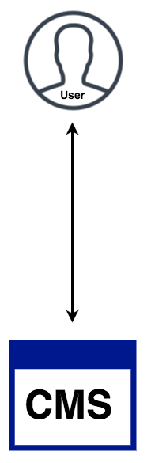

#Non-headless (traditional)

No hard separation. Drupal handles data processing and theming.

---


##Non-headless

###Pros:thumbsup:

- Likely already pretty good at it

- Everything under the hood already

###Cons:thumbsdown:

- Slow and expensive async interactions

- Often difficult to customize markup of UI elements

^For the sake of comparison

---


#Fully Decoupled

Full separation between data layer and front-end layer.

Think: Single page apps (SPAs).

---


##Fully decoupled 


###Pros :thumbsup:
- Snappy interactions via client side rendering

- Fully customizable interfaces/markup

- Easily swappable front-end/back-end

###Cons :thumbsdown:

- Missing out on some of Drupal's best features

- JS reliance, _generally_

- SEO and crawler drawbacks, _generally_


^Editing in-place, menu system, routing, built-in login, built-in search, built-in 404/403. All things you’d need to rebuild.d

^Initial bootstrap for frameworks on mobile sooo slow

^Sometimes the web isn't perfect perfect

^Lots of mobile browses still have trouble with JS

---

#Doesn't need to be all or nothing

###We leveraged the strength of both :muscle:

---

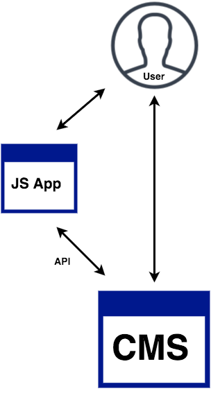

#Hybrid

Some sections of site are separated for responsive interfaces, Drupal handles rest of the theming.

Think: dashboards, calculators, applets.

---


#Hybrid 

###Pros :thumbsup:

- Speedy interfaces via JS when needed
- Sturdy Drupal rendering when not
- Rollout in stages

###Cons :thumbsdown:

- SEO and crawler downsides (avoidable)
- Still requires another framework to learn,develop,maintain


---

#Calendar Requirements
 
- Toggle months
- Filtering
- Quick event popup
- Snappy interactions
- Alternate list view mode


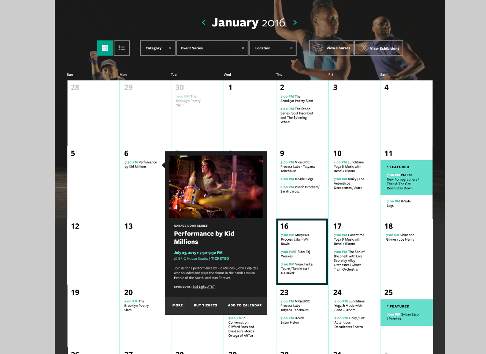

---

#Calendar Requirements cont.
 
- Toggle months
- Filtering
- Quick event popup
- Snappy interactions
- **Alternate list view mode**

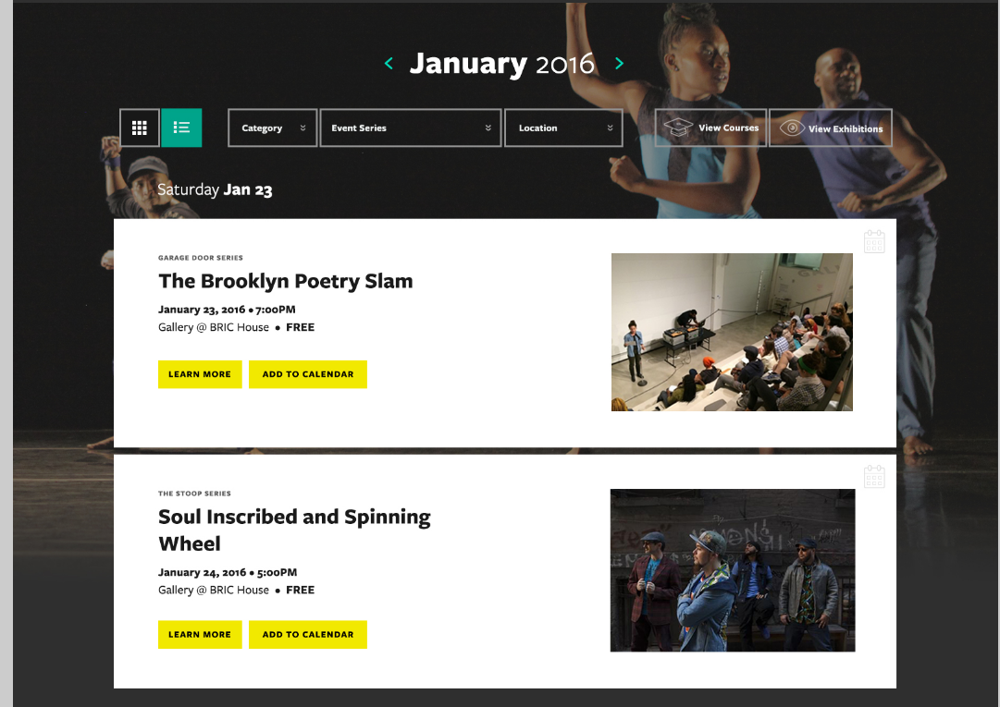


---


---

#Calendar Implementation

- API via custom module
- ReactJS frontend
- Redux state management
- Gulp to transform ES6 => ES5
- Robust API caching
- Server-side rendering w/ view

----

#Including app into template


----

#Including app into template

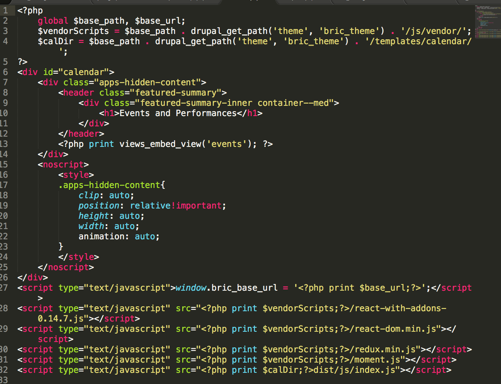

----

#App file structure

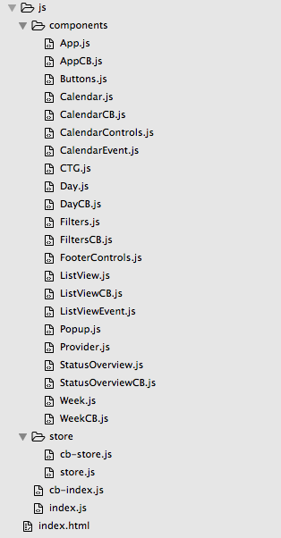

----

#API

- Served up all data at once (for performance)
  - Reduced asynchronous requests

- Drupal DB schema doesn't lend itself to API creation

- We prefered using a custom module + menu hook

  - Though many ways to create APIs in Drupal

---

#API Caching


- Set cache after expensive query

- Drupal static cache + page cache + Varnish

- Clear _and_ rebuild cache on node update, insertion

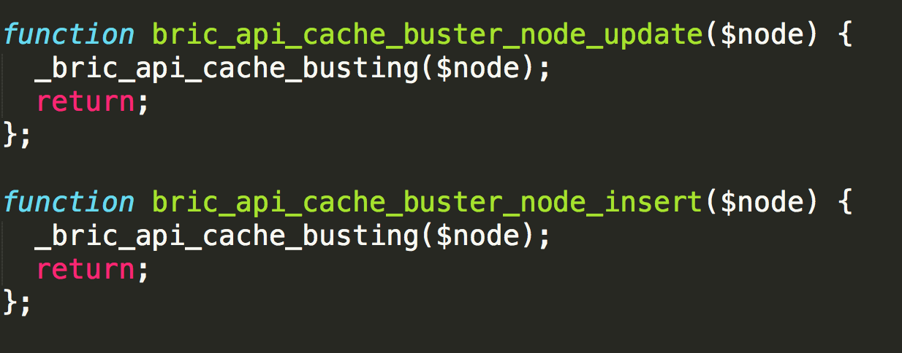

---


#BRIC API Caching

Redundancies to ensure user never requests from DB directly, always a cached version available 

---

#API Caching Results 🤓

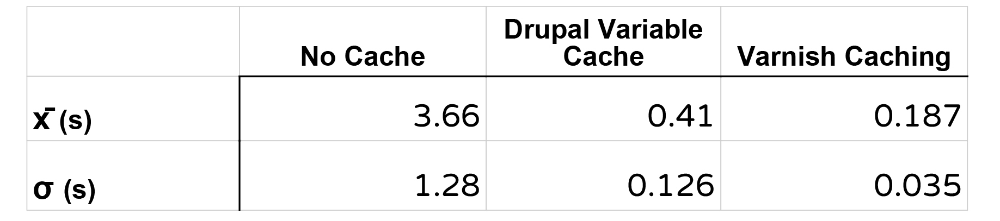

n = 10, 600+ nodes w/17 fields each, 46kb

---


^Two view modes, decoupled makes it esasy,same data

----

#Server-side rendering

- Content is generated for **initial** render

- Client handles subsequent renders

- SEO and crawler benefits 🤖

- Decent JS fallback

----

##Server-side rendering implementation

Simple solution? Use a view

^ More robust solution? Add a node server in your stack

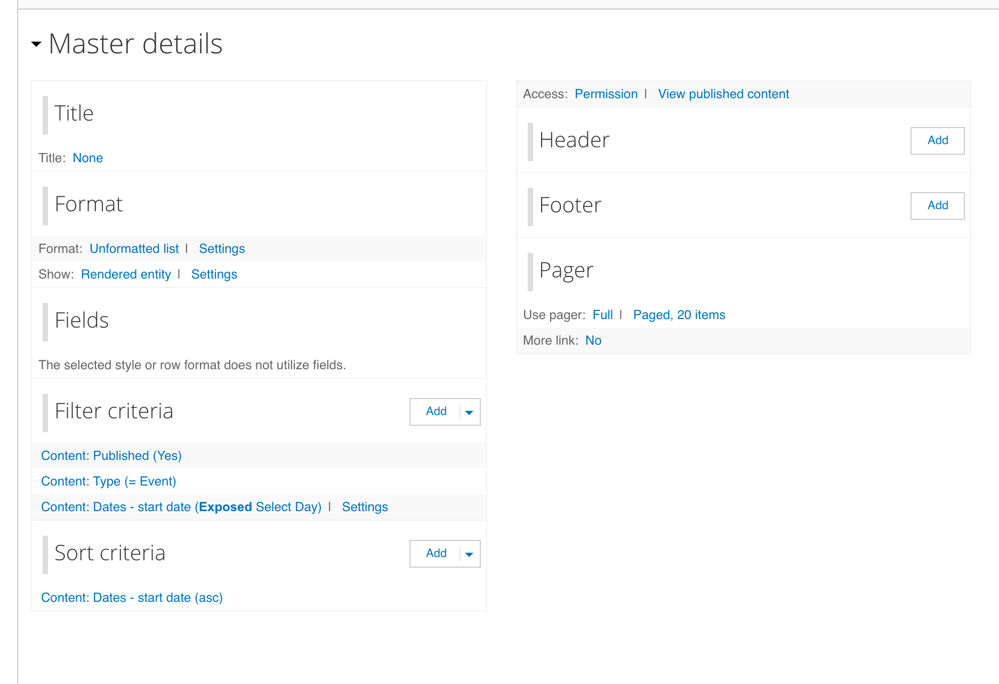

^Simple solution not bad

^Limited hosting resources, limited time

^More time put a node.js stack in there somewhere

___

###BRIC server-side rendering

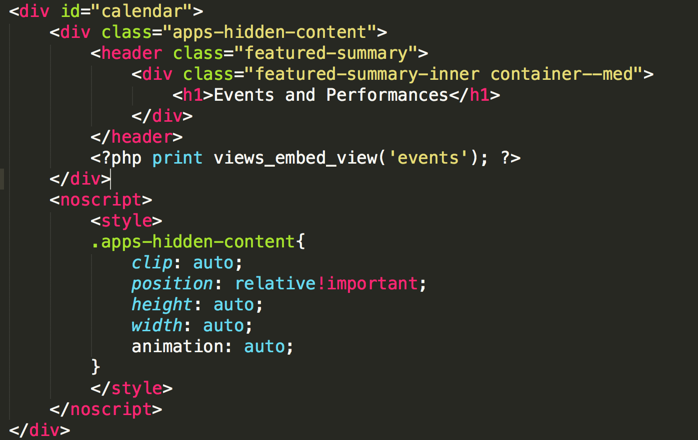

---

###BRIC server-side rendering


---

##Hybrid approach: more success


^Custom filters

^Snappy interactions

^Custom filters

^Finite data set

---

##Hybrid approach: less success
### 
##Blog

- Ended up recreating functionality
  - Pagination, view, filters, attachments
- Performance on par w/ views
- More difficult to maintain
- Benefits didn't ouweight drawbacks
- Ultimately scrapped

---

#Takeaways  :sunglasses:

The headless approach isn’t about following the trend and applying it haphazardly. It’s about engineering a product using the best of a coupled and decoupled approach that can leverage the power of all the tools and skills at your disposal. 

---

#Takeaways  :sunglasses:

...but with that said, the hybrid approach was extremely valuable with BRIC.

^Since it's not all or nothing, there's little investment and you can start using it on your site today.


---

# Paragraphs!

^ The next Highlight of the site I want to present is how we used Paragraphs to achieve a modular site design that’s simple to administer and scales for the client’s future needs

^ BRIC Specifically, we believe paragraphs enhanced this site, that otherwise would have been a lot more custom code.

^ Thank you ___ for a great intro in Paragraphs module.
Show of hands, who is familiar with P module?

---

# Paragraphs!

^ LEGO Bricks example. Many types/colors of bricks, can be combined in diffrent ways.

^ Today I want to:
Walk us through our process with BRIC.
Second some Cool stuff we did.
Then real briefly some of the Pros and Cons of Paragraphs.

---

# Our Process
### Two main questions we ask ourselves for using Paragraphs module.

- How do we decide on using the Paragraphs Module?
- How do we decide what Paragraph Bundles to use?

---

## How do we decide on using the Paragraphs Module?

1. Type of site
  a. Build it and leave it type of site.
  b. Continually adding content.
1. Design
  a. Content or body of each design.
  b. How would an editor interact with this content?
  c. Could it be accomplished in another way?

^ First question to ask is:

^ 2 types of sites. 1. Build and leave it alone. 2. Content authors continually adding content.
If adding content site, adds flexibility for content authors and designs.
Specifically with BRIC, Events/Exhibitions, Blogs, Courses, General Pages.
As the developer, you need to make the call. I'd advise to make it early on.

---

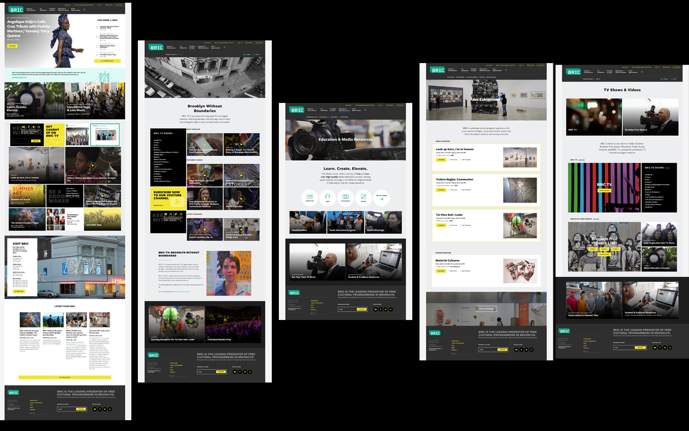

^ These designs look very different, without paragraphs, there might be up to 4 different ways of handeling these layout.

^ We can achieve all these designs with one content type.

^ As you can see here, there are natural rows to these designs.

^ Once we've decided we want to use PARAGRAPHS, On to the second question...

---

## How do we decide what Paragraph Bundles to use?

### Design & Content

1. What is the content or body part of the page?
2. What needs to be flexible?
3. How would an editor interact with this content?

^ Second question is:

^ We are re-asking some of the same questions. But now we really care about the answers.

---

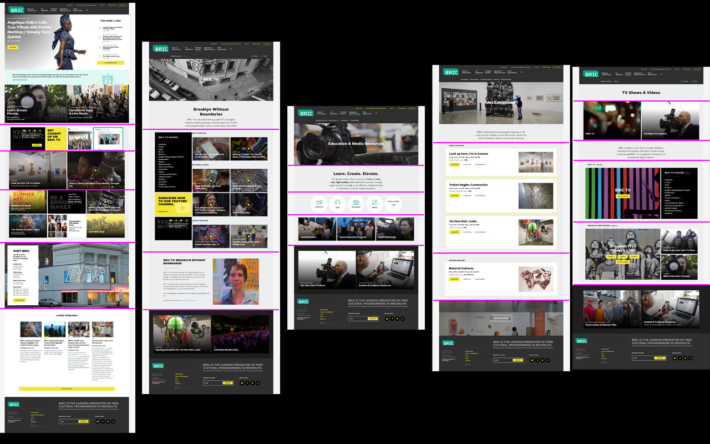

^ We sliced up the different sections.

---

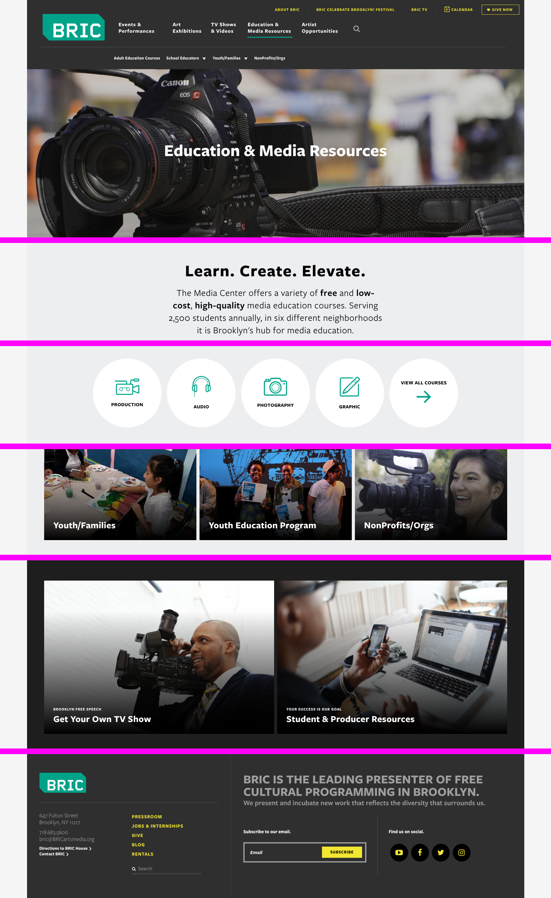

^ Later we realized, we wanted this one section to always be at the footer. We pulled it out the body paragraph field and added a 'Footer callout' field at the bottom.

^ So these so far have been landing pages with What could be blocks. They are callouts to other sections. But you can even breakup detailed content pages into paragraphs as well.

---


^ Detail pages

^
Slideshow
Text
Special Button
Text
Youtube link

^ ... And here is a video showing you a little bit.

---


^ You can end up with a lot of bundles.

---

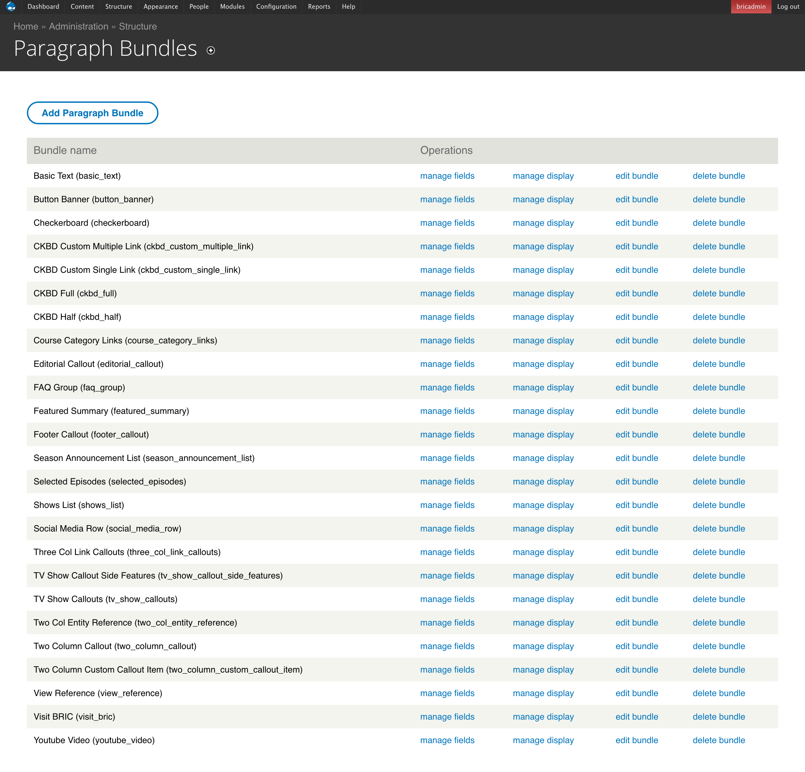

^ Here is a list of all our bundles

^ 25 Paragraph Bundles and growing...

---

# Going beyond the basics

> You can also add custom option fields and do conditional coding in your CSS, JS and preprocess functions so that end-users can have more control over the look and feel of each item. This is way much cleaner and stable than adding inline CSS or classes inside the body field's source.

^ From the paragraphs module page. This I believe really is the power behind the paragraph bundles. Once you get past the tpls.

^ We had a lot of entity references to highlight sections or events throughout the site. And some override titles. But some of these we just weren't sure how to handle.

^ And here comes some of this fun stuff...

---

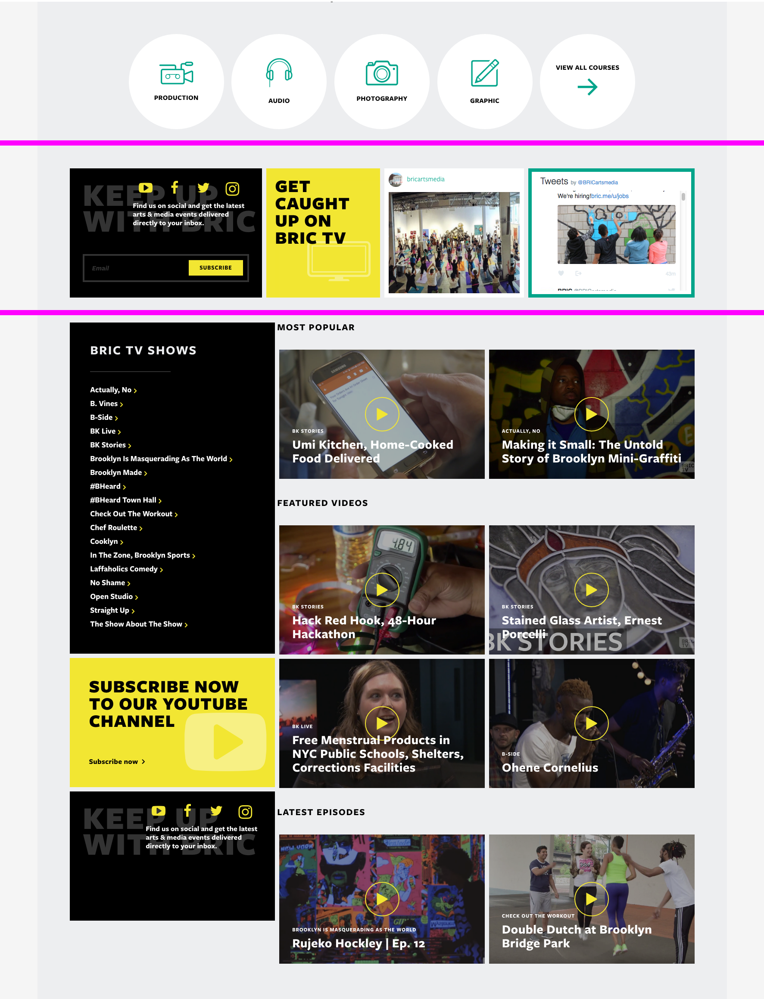

^ First, we have display of taxonomy terms.

^ Second, we pull in global social media accounts and sign up forms.

^ Third, Highly custom... but we are pulling in global settings for social media.

---

## 'Visit BRIC' Bundle


^ This is a bundle we wanted the be able to use throughout the site. But it has very specific content. Global content. We didn't want the author to re-create this content over and over again every time they wanted this bundle to show up.

^ so when the author adds this to their content, they don't have to fill in any fields. Its just there.

---

## 'Visit BRIC' Bundle

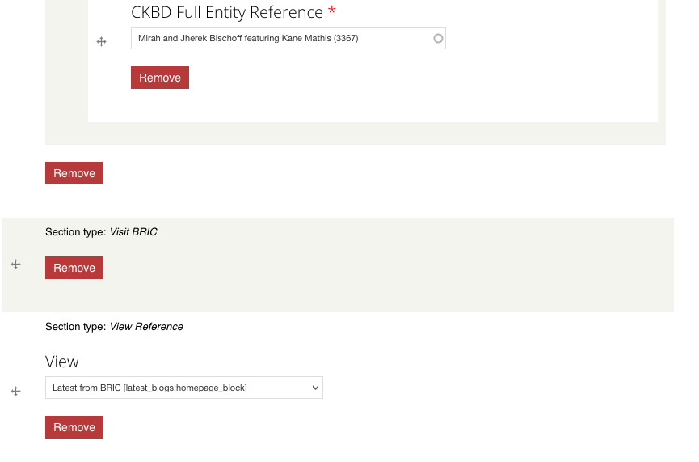

^ Here is what the admin sees.

^ SIDE NOTE: Now this can also be done with some custom fields, maybe a title or background image, etc, and global content.

^ How do we get the content there?

---


^ How do we get the content there?

---

## Visit BRIC Settings Page

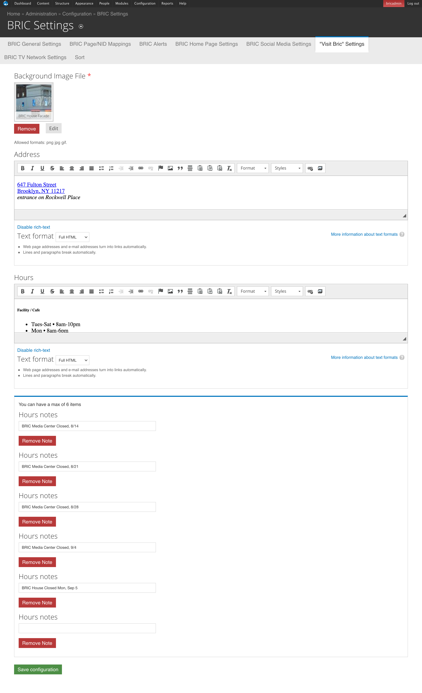

^ And then we have this helpful settings page to fill in the global content. And only one place to change the data.
And then we insert it through a hook.

---

``` php
/**
 * Implements hook_preprocess_entity().
 */
function bric_settings_preprocess_entity(&$vars, $hook) {
  if ($vars['entity_type'] == 'paragraphs_item') {
    if ($vars['paragraphs_item']->bundle == 'visit_bric') {
      // Grab settings variable.
      $settings = variable_get('bric_settings_visit_bric', array());
...
      // Build content array
      $vars['content']['bg_image'] = $bg_image_render_array;

      $vars['content']['address'] = array(
        '#markup' => check_markup($settings['address']['value'], $settings['address']['format']),
      );
      $vars['content']['hours'] = array(
        '#markup' => check_markup($settings['hours']['value'], $settings['hours']['format']),
      );

      $vars['content']['notes'] = ...
...
    }
  }
}

```

^ hook\_preprocess\_entity
target paragraphs_item entity
target the bundle
grab settings variable
now process those fields

---

### Inserting the content
#### paragraphs-item--visit-bric.tpl.php

``` html
<article class="hero--info-block">
  <div class="hero-image">
    <?php print render($content['bg_image']); ?>
  </div>
  <div class="hero-content-container cf">
    <div class="info-block">
      <h2 class="info-block-title">Visit BRIC<span class="icon-location"></span></h2>
      <div class="visit-bric-address arrow-after--yellow">
        <?php print render($content['address']); ?>
      </div>
      <?php print render($content['hours']); ?>
      <?php print render($content['notes']); ?>
      <a class="btn" href="/directions">Get Directions</a>
    </div>
  </div>
</article>
```

---

# Pros

1. Flexibility
1. Modular
1. Reorder content
1. Reusability
1. Less frustrating editor experience
1. Scales for easy future development

^ Greatest flexibility with least complexity

---

# Cons

1. Flexibility
1. Templates can get complicated quickly
1. Each entry adds another entity to the field (performance)

^ Paragraphs can contain paragraphs that can contain paragraphs, etc.

^ If your site doesn't warrant using it, don't!

---

# Thanks!

^ Thanks to Ben for inviting us and giving us this opportunity.
